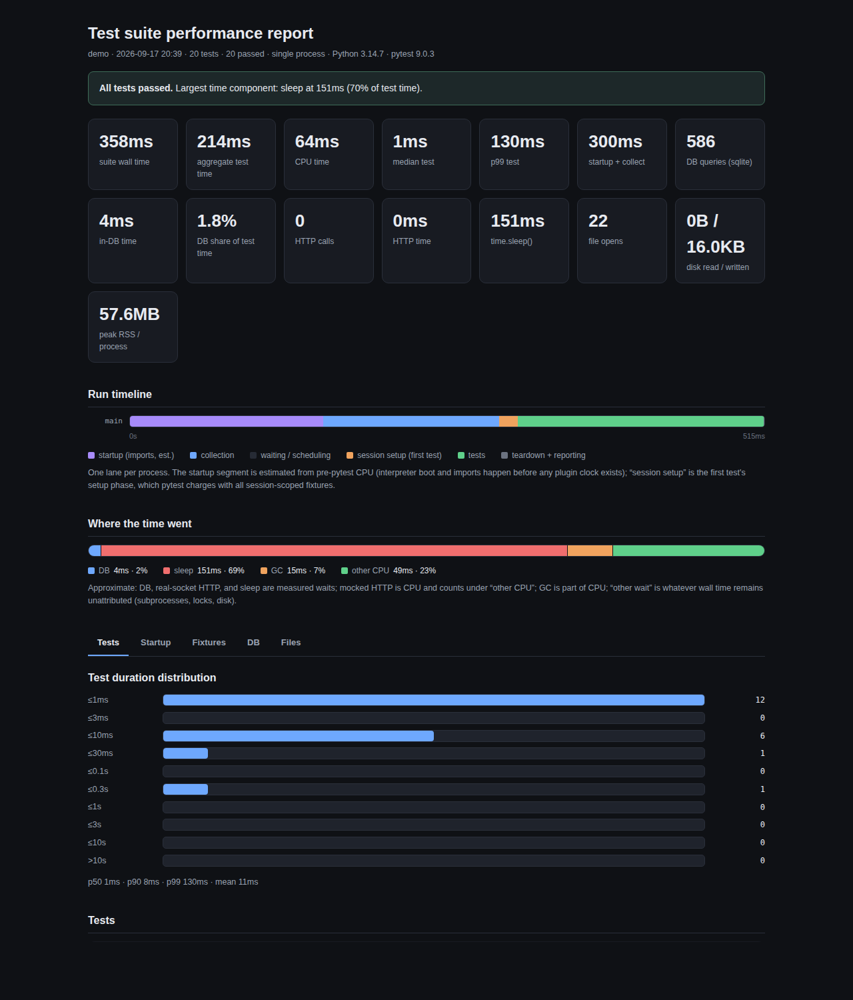

# pytest-perf-report

An opinionated, self-contained performance report for your pytest suite.
Drop it in, add one flag, get one HTML file that tells you where the time
went, what your tests are really doing to the database, the network, and the
disk — and a short, prioritized list of what to fix first.

```bash
pip install pytest-perf-report
pytest --perf-report                 # writes perf-report.html
pytest --perf-report=reports/run.html --perf-report-json=reports/run.json
pytest --perf-report --perf-report-baseline=reports/run.json   # diff vs a previous run
pytest --perf-report --perf-report-sql-origins   # + per-query call-site attribution
pytest --perf-report --perf-report-cpu-profile   # + per-function CPU breakdown
```

Works unchanged under pytest-xdist: each worker records its own tests and the
controller merges everything into one report.



## What you get

A single dark, dense, dependency-free HTML page:

- **Headline numbers** — suite wall time, aggregate test time, CPU time,
  median/p99 test duration, startup + collection cost, parallel efficiency.
- **Startup & collection** — the startup tax decomposed into pre-pytest
  imports vs. collection; the slowest test modules to *collect* (collection
  imports the module, so module-scope work — globs, file reads, parametrize
  builders — lands here and is paid even by `-k` runs that select none of the
  module's tests); total time inside `pytest_collection_modifyitems` hooks
  (where conftest hooks that walk every item hide); and the heaviest imports
  executed while plugins and conftests loaded (settings modules, app
  registries, and everything they pull in). All of it is re-paid by every
  xdist worker.
- **Where the time went** — an approximate decomposition of in-test time into
  DB wait, real-socket HTTP wait (time spent in mocked HTTP is CPU and is
  counted as such), `time.sleep()`, GC pauses, other CPU, and unattributed
  wait.
- **Database** — total queries and in-DB time (split into in-test vs.
  outside-of-test work like migrations), top query *shapes* by count and by
  time, and N+1 suspects (the same shape running ≥25× inside a single test).
  Every shape records the call-site of its first occurrence and the test where
  it repeated the most ("peak 62× in test_x"), so a suspicious shape points
  straight at code. With `--perf-report-sql-origins`, full per-query call-site
  counts are captured instead (per-query stack walk; profiling runs only).
- **Vs baseline** — point `--perf-report-baseline` at a previous
  `--perf-report-json` file to get before/after totals, the biggest
  query-shape changes (new and removed shapes flagged), per-test wall-time
  regressions on the tests common to both runs, and regression TODOs when
  queries-per-test or time-per-test grow >10%.
- **Stability & memory** — flaky tests that needed reruns to pass
  (pytest-rerunfailures aware), peak RSS per process, and the tests that
  raised the process's memory high-water mark.
- **HTTP & network** — calls and time by host, whether each host was answered
  by a transport-level mock or a real socket, and every raw socket connection
  with a loopback/external classification (external = your suite is not
  hermetic).
- **Files & disk** — `open()` counts, the most-reopened files with an
  estimated re-read volume (opens × file size, so a 5× reopen of a small JSON
  file isn't dressed up as a finding), and real disk bytes read/written
  (Linux).
- **Tests** — failures with tracebacks, the slowest tests with a per-test
  wall/setup/call/CPU/queries/HTTP breakdown, the fastest tests (your
  overhead floor), and a duration histogram. Each process's first test is
  flagged when its "slowness" is really session-scoped fixture setup being
  charged to it.
- **Fixtures** — the costliest fixtures by total *and self* setup time (self
  excludes fixtures pulled in dynamically via `request.getfixturevalue`),
  with the DB queries and writes each fixture issues during setup, plus
  scope/autouse labels and a dedicated "per-test taxes" table of
  function-scoped autouse fixtures that run for every test.
- **CPU** — with `--perf-report-cpu-profile`, every test runs under cProfile
  and the report adds a function-level self-time table, decomposing the
  "other CPU" bucket.
- **Warnings** — totals and the most frequent messages.
- **What to do about it** — a generated, prioritized TODO list. Each item
  cites its evidence: fix failures, stop talking to the real network, delete
  sleeps, batch N+1 queries, widen fixture scope, parallelize, freeze the GC,
  and so on. If nothing is wrong it says so.

A `--perf-report-json` flag emits the same data as versioned JSON for CI
trending or custom tooling.

## How it measures

Everything is opt-in and zero-overhead when the flag is absent — the plugin
registers its CLI options and otherwise never touches a clock.

| Signal | Mechanism |
| --- | --- |
| DB queries (Django) | `execute_wrapper` on every connection, any backend |
| DB queries (SQLAlchemy) | `before/after_cursor_execute` engine events |
| Disk IO | `/proc/self/io` deltas (Linux only) |
| Collection hooks | `pytest_collection_modifyitems` hookwrapper (brackets all other implementations) |
| File opens | `open()` / `io.open()` wrapper (covers `pathlib`) |
| Fixture cost | `pytest_fixture_setup` hookwrapper (total + self time, setup-phase query attribution) |
| GC pauses | `gc.callbacks` |
| Per-function CPU | `cProfile` per test, merged self-times (opt-in flag) |
| Per-module collection | `pytest_make_collect_report` hookwrapper on `Module` nodes (module import + item generation) |
| Startup imports | `builtins.__import__` timer, active only from initial-conftest loading until `pytest_configure` |
| HTTP (low level) | `http.client` `putrequest`/`getresponse` wrappers (covers urllib, urllib3, requests, botocore) |
| HTTP (client level) | `requests.Session.send` / `httpx.Client.send` wrappers — also sees calls answered by mocks like `responses` |
| Per-test CPU | `time.process_time()` brackets |
| Sleeps | `time.sleep` wrapper |
| Sockets | `socket.socket.connect` wrapper, loopback vs. external |

Probes for optional libraries (Django, SQLAlchemy, requests, httpx) detect
availability at import time and silently skip when absent. Query shapes are
normalized purely by pattern (placeholders, literals, IN-lists collapsed), so
shape aggregation works for any SQL dialect.

## Known blind spots

Documented trade-offs, not bugs:

- Database drivers that connect and speak in C (psycopg, mysqlclient) don't
  appear in the *socket* table — their queries are still fully measured by
  the ORM-level probes, which is where useful attribution lives.
- `asyncio.sleep` is not counted (the event loop keeps doing work; charging
  its wall time as "sleep" would be misleading). `time.sleep` is counted.
- Non-blocking (asyncio) socket connects are counted, but their wait happens
  in the selector, so their connect *time* reads ~0.
- `os.open` and `codecs.open` bypass the file probe; `open` and `io.open`
  (which `pathlib` uses) are covered.
- HTTP response *body* streaming after headers arrive isn't attributed to
  HTTP time.
- Expect a modest overhead while profiling (per-query normalization, wrapped
  syscall seams). This is a profiling run, not a benchmark run.
- xdist support assumes local workers (shards are written to a shared temp
  directory). If a worker's shard is missing — crashed worker, non-shared
  filesystem — the report and terminal summary say so instead of silently
  under-reporting.

## Requirements

Python ≥ 3.10, pytest ≥ 7. No other dependencies.

## Contributing

See [CONTRIBUTING.md](CONTRIBUTING.md). Changes are listed in
[CHANGELOG.md](CHANGELOG.md).

## License

MIT.
